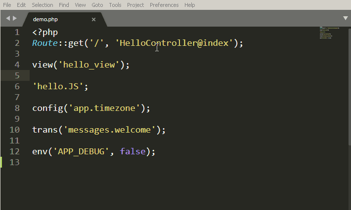
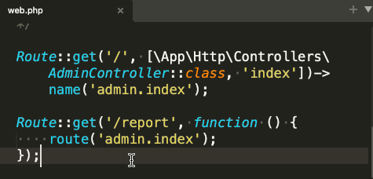
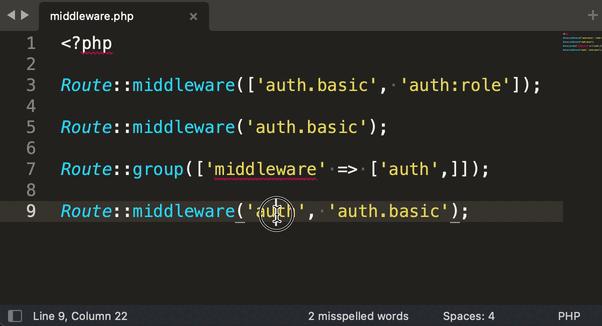
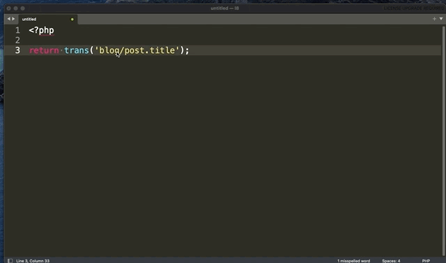
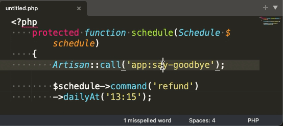

# Laravel Goto

[](https://packagecontrol.io/packages/Laravel%20Goto)


[](https://ko-fi.com/absszero)

Goto various Laravel files



## Features

### Go to Blade

Go to blade template files.

```php
view('hello_view', ['name' => 'James']);

Route::view('/', 'pages.public.index');

@includeIf('view.name', ['status' => 'complete'])

@each('view.name', $jobs, 'job', 'view.empty')

@extends('layouts.app')
```

Go to blade Component files.

```php
<x-alert:hello />
```

### Go to Controller

Go to controllers and highlight method.

```php
Route::get('/', 'HelloController@index');

Route::resource('photo', 'HelloController', ['only' => [
  'index', 'show'
]]);
```

### Go to Controller from route helper



### Go to Middleware



### Go to Config

Go to config files and highlight option.

```php
Config::get('app.timezone');
Config::set('app.timezone', 'UTC');
```

### Go to Filesystem config

Go to filesystem config file and highlight option.

```php
Storage::disk('local')->put('example.txt', 'Contents');
```

### Go to Language

Go to single language file or open all and highlight option.



### Go to .env

```
env('APP_DEBUG', false);
```

### Go to Command




### Go to Inertia.js

```php
Route::inertia('/about', 'About/AboutComponent');

Inertia::render('MyComponent');

inertia('About/AboutComponent');
```

### Go to Livewire

```php
@livewire('nav.show-post')

<livewire:nav.show-post />
```

### Go to path helper

```php
app_path('User.php');

base_path('vendor');

config_path('app.php');

database_path('UserFactory.php');

public_path('css/app.css');

resource_path('sass/app.scss');

storage_path('logs/laravel.log');
```

### Go to Static files

```php
$file = 'js/hello.js';
```

Default supported static file extensions:

- js
- ts
- jsx
- vue
- css
- scss
- sass
- less
- styl
- htm
- html
- xhtml
- xml
- log


## Installation

### Package Control

1. `Ctrl+Shift+P` then select `Package Control: Install Package`
2. Type `Laravel Goto`

### Manually

-  MacOS

   ```shell
   git clone https://github.com/absszero/LaravelGoto.git ~/Library/Application\ Support/Sublime\ Text\ 3/Packages/LaravelGoto
   ```

- Linux

  ```shell
  git clone https://github.com/absszero/LaravelGoto.git ~/.config/sublime-text-3/Packages/LaravelGoto
  ```

- Windows

  ```shell
  git clone https://github.com/absszero/LaravelGoto.git %APPDATA%\Sublime Text 3\Packages\LaravelGoto
  ```


## Usage

- Select a text, `Right-Click` to open content menu, Press `Laravel Goto` or use <kbd>Alt</kbd> + <kbd>;</kbd>.


## Settings

### PHP bin

```json
"php_bin": "c:\\php\\php.exe"
```

### Show hover popup if available

```json
"show_hover": true
```

### Extend static file extensions

You can add other file extensions throught `Preferences > Package Settings > LaravelGoto > Settings`, and add this option `static_extensions`

```json
"static_extensions": [
    "your_extension_here"
]
```
