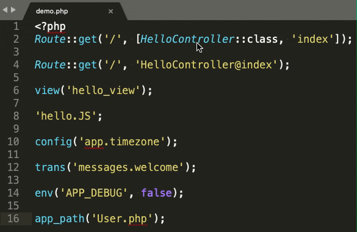
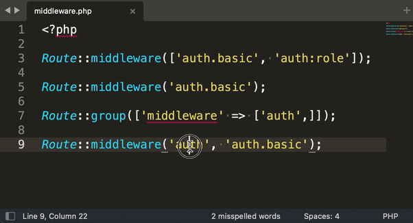
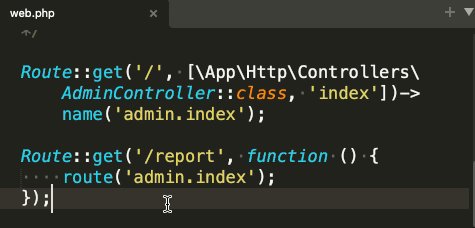
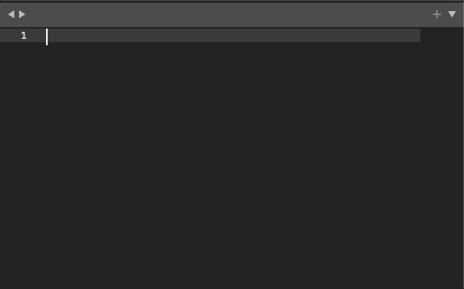
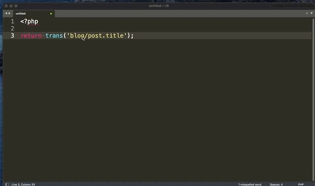
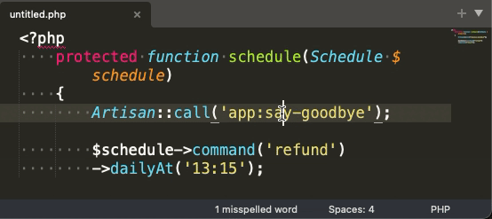
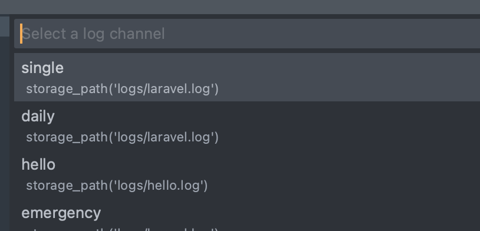

# Laravel Goto

[](https://packagecontrol.io/packages/Laravel%20Goto)

[](https://ko-fi.com/absszero)

Quick navigation extension for Laravel projects. Jump to views, controllers, configs, language files and more with a single click.



## Usage

**Method 1:** Select text and press <kbd>Alt</kbd> + <kbd>;</kbd>

**Method 2:** Select text → Right-click → Choose `Laravel Goto`

---

## Features

### Views & Components

#### Blade Templates
Jump to blade view files from:
```php
view('hello_view', ['name' => 'James']);

Route::view('/', 'pages.public.index');

@includeIf('view.name', ['status' => 'complete'])

@each('view.name', $jobs, 'job', 'view.empty')

@extends('layouts.app')
```

#### Blade Components
```php
<x-alert:hello />
```

#### Inertia.js
```php
Route::inertia('/about', 'About/AboutComponent');

Inertia::render('MyComponent');

inertia('About/AboutComponent');
```

#### Livewire
```php
@livewire('nav.show-post')

<livewire:nav.show-post />
```

---

### Controllers & Routes

#### Controller Actions
Jump to controllers with method highlighting:
```php
Route::get('/', 'HelloController@index');

Route::resource('photo', 'HelloController', ['only' => ['index', 'show']]);
```

#### Middleware


#### Route Helpers


#### URI-based Navigation
Use command `Laravel Goto: Go to Controller via Uris` to browse all routes:



---

### Configuration

#### Config Files
Jump to config files with option highlighting:
```php
Config::get('app.timezone');

Config::set('app.timezone', 'UTC');
```

#### Filesystem Disks
```php
Storage::disk('local')->put('example.txt', 'Contents');
```

#### Environment Variables
```php
env('APP_DEBUG', false);
```

---

### 🌐 Localization

Jump to language files or open all matching files with highlighting:



---

### Other Features

#### Artisan Commands


#### Path Helpers
```php
app_path('User.php');

base_path('vendor');

config_path('app.php');

database_path('UserFactory.php');

public_path('css/app.css');

resource_path('sass/app.scss');

storage_path('logs/laravel.log');
```

#### Static Files
Jump to static assets:
```php
$file = 'js/hello.js';
```
**Supported extensions:** js, ts, jsx, vue, css, scss, sass, less, styl, htm, html, xhtml, xml, log

#### Log Files
Use command `Laravel Goto: Go to Log file`:



---

## Installation

### Package Control
1. Press `Ctrl+Shift+P` then select `Package Control: Install Package`
2. Search for `Laravel Goto`

### Manually
Clone the repository into your Sublime Text `Packages` directory:

- **MacOS:** `~/Library/Application Support/Sublime Text 3/Packages/LaravelGoto`
- **Linux:** `~/.config/sublime-text-3/Packages/LaravelGoto`
- **Windows:** `%APPDATA%\Sublime Text 3\Packages\LaravelGoto`

---

## Settings

You can customize the extension via `Preferences > Package Settings > LaravelGoto > Settings`.

| Key | Description | Default |
| :--- | :--- | :--- |
| `php_bin` | Path to your PHP executable | `"php"` |
| `show_hover` | Show hover phantom if available | `true` |
| `static_extensions` | Additional static file extensions to support | `[]` |

**Example configuration:**
```json
{
    "php_bin": "c:\\php\\php.exe",
    "show_hover": true,
    "static_extensions": ["webp", "svg"]
}
```